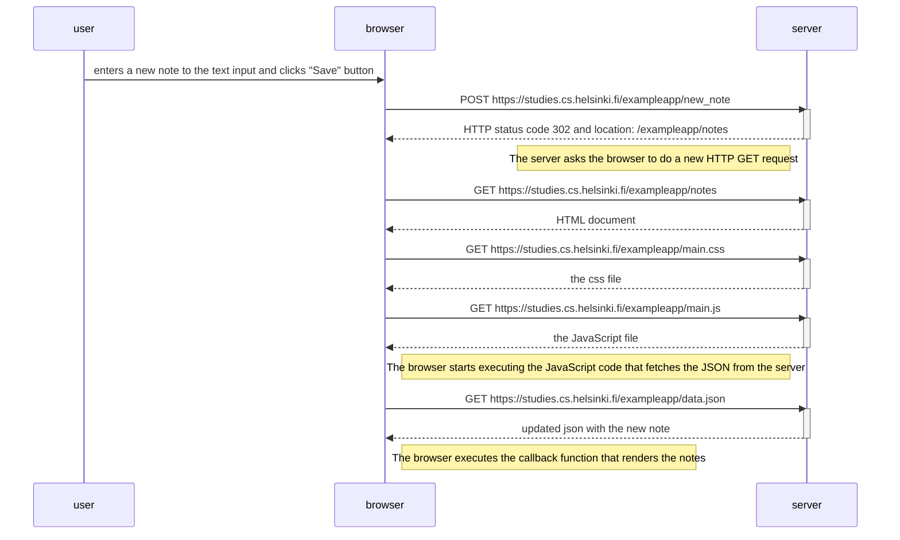

```mermaid
sequenceDiagram;
    participant user;
    participant browser;
    participant server;
    
    user->>browser: enters a new note to the text input and clicks "Save" button;

    browser->>server: POST https://studies.cs.helsinki.fi/exampleapp/new_note;
    activate server;
    server-->>browser: HTTP status code 302 and location: /exampleapp/notes;
    deactivate server;
    Note left of server: The server asks the browser to do a new HTTP GET request;
    
    browser->>server: GET https://studies.cs.helsinki.fi/exampleapp/notes
    activate server
    server-->>browser: HTML document
    deactivate server
    
    browser->>server: GET https://studies.cs.helsinki.fi/exampleapp/main.css
    activate server
    server-->>browser: the css file
    deactivate server
    
    browser->>server: GET https://studies.cs.helsinki.fi/exampleapp/main.js
    activate server
    server-->>browser: the JavaScript file
    deactivate server
    
    Note right of browser: The browser starts executing the JavaScript code that fetches the JSON from the server
    
    browser->>server: GET https://studies.cs.helsinki.fi/exampleapp/data.json
    activate server
    server-->>browser: updated json with the new note
    deactivate server    

    Note right of browser: The browser executes the callback function that renders the notes 
```
