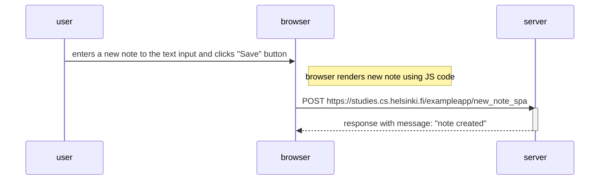

```mermaid
sequenceDiagram
    participant user;
    participant browser
    participant server
    
    user->>browser: enters a new note to the text input and clicks "Save" button;
    
    Note right of browser: browser renders new note using JS code
    browser->>server: POST https://studies.cs.helsinki.fi/exampleapp/new_note_spa
    activate server
    server-->>browser: response with message: "note created"
    deactivate server
```
